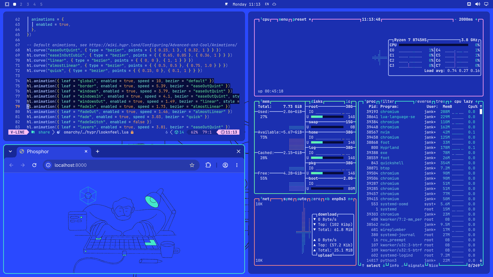
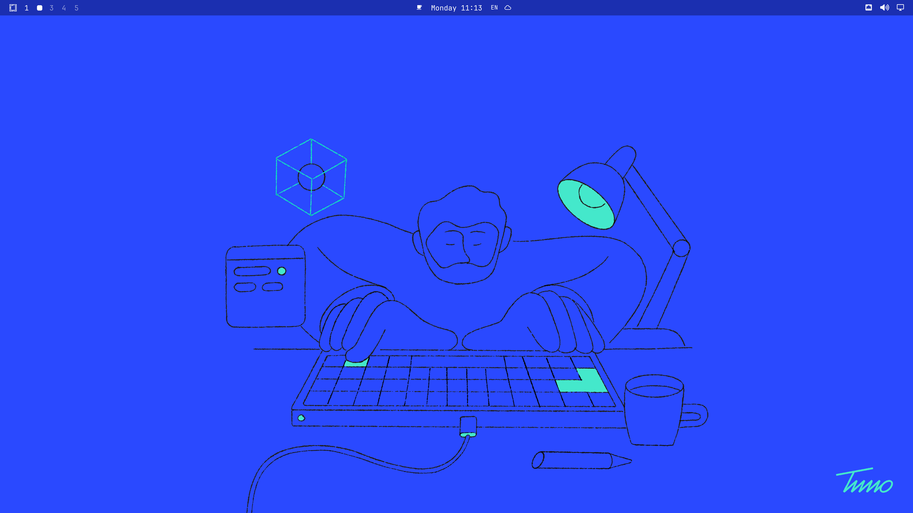
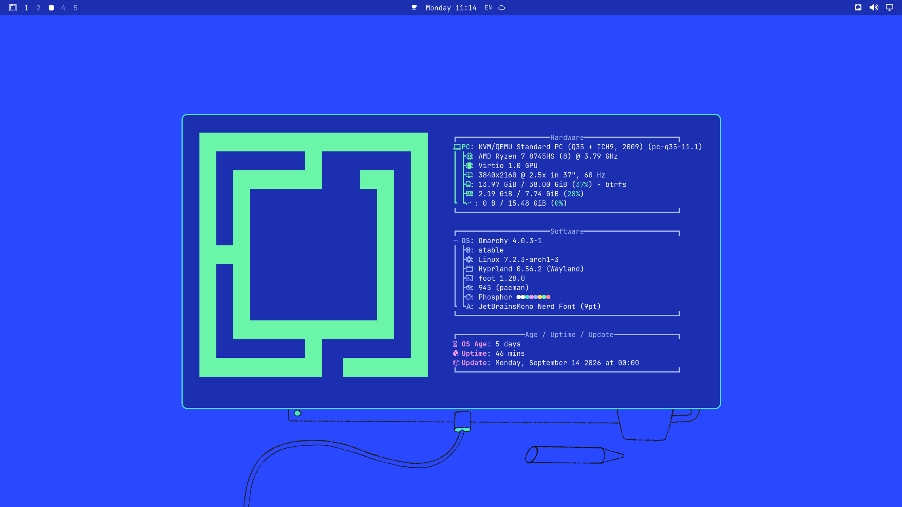

# Phosphor

MS-DOS blue with mint, for [Omarchy](https://omarchy.org).

**Design and illustration by [Timo Kuilder](https://timokuilder.com)** (see [CREDITS.md](CREDITS.md)). The whole palette comes out of his drawing; the theme was built around it, not the other way around.







## Palette

| | | |
|---|---|---|
| `#2A49FF` | MS-DOS blue | wallpaper, active surfaces |
| `#070C3A` | deep navy | selection |
| `#44E8CB` | mint | accent, active window border |
| `#212121` | near black | the line work in the drawing |
| `#1B2FB0` | deeper blue | window background |

Timo's drawing sits on the bright `#2A49FF`. Windows sit a good deal deeper on `#1B2FB0` so text reads well against them: white gets 10.1:1 there and the comment colour 5.2:1. Selection is a deep navy `#070C3A`. Omarchy always draws selected text in white, and a lighter blue would barely stand out from the window, so the selection goes darker instead.

## Install in Omarchy

```bash
git clone git@github.com:jankeesvw/omarchy-phosphor-theme.git ~/Documents/github.com/jankeesvw/omarchy-phosphor-theme
ln -sfn ~/Documents/github.com/jankeesvw/omarchy-phosphor-theme ~/.config/omarchy/themes/phosphor
omarchy theme set phosphor
```

Or straight from the repo, letting Omarchy manage the clone:

```bash
omarchy theme install git@github.com:jankeesvw/omarchy-phosphor-theme.git
```

Cycle the backgrounds with `omarchy theme bg next`.

## Open it in Aether

Aether reads the exact same `colors.toml`:

```bash
aether --import-colors-toml ./colors.toml --wallpaper ./backgrounds/1-phosphor-desk.png
```

Note that this overwrites the theme in `~/.config/aether/theme` and switches Omarchy to the `aether` theme. To get the standalone theme back afterwards, run `omarchy theme set phosphor`.

## Backgrounds

The drawing is 1.75:1 and your screen is probably 16:9. Omarchy scales with `PreserveAspectCrop`, which would cut off the top and bottom. So the drawing sits on a 5120x2880 canvas with the same blue around it: at 80% of the width, aligned to the bottom edge so the cable runs off the screen.

- `1-phosphor-desk.png` — the drawing
- `2-dos-blue.png` — flat blue

One thing to know if you change these: the shell caches backgrounds by file path. Write a new version to the same filename and you will keep seeing the old one. Give the file a new name instead.
